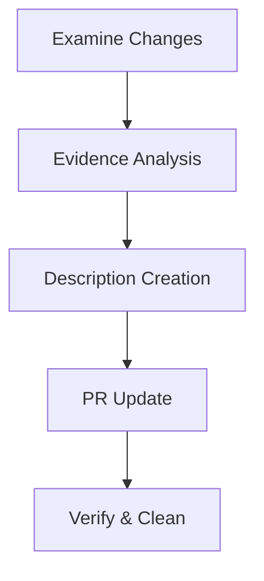

# PR Description Workflow

This workflow describes the process for crafting clear, evidence-based PR descriptions that effectively communicate changes.

## Overview



## Steps

### 1. Examine Changes

Use GitHub CLI to gather information non-interactively:

```bash
# Get PR info without pager
gh pr view <PR-NUMBER> --json body,title,number,files,commits | cat

# Get diff without pager
gh pr diff <PR-NUMBER> | cat
```

- Review changed files list
- Analyze commit messages
- Study code changes in detail

### 2. Evidence-Based Analysis

Iterate through each significant change:

1. Identify concrete evidence in code
2. Discuss each piece of evidence to determine:
   - Is it a significant change?
   - How should it be categorized?
   - What's the best way to describe it?
3. Group changes into categories:
   - Architecture Changes
   - New Features
   - Code Organization
   - Migration Notes

### 3. Description Creation

Structure the description using these sections:

```markdown
# Description

### 🏗 Architecture Changes

- Evidence-backed change 1
- Evidence-backed change 2

### 🆕 Features

- New feature 1 with evidence
- New feature 2 with evidence

### 📦 Code Organization

- Organization change 1
- Organization change 2

### 🔄 Migration

- Migration notes if applicable
```

### 4. PR Update Process

This process ensures the existing PR description template is honored.

```bash
# 1. Get the current PR body and save it to a temporary file
gh pr view <PR-NUMBER> --json body | jq -r .body > current-pr-body.txt

# 2. Prepare the new description.
#    The new content for "Description of the change" should be in a variable, e.g., NEW_DESCRIPTION.
#    This example uses sed to replace the content of "Description of the change".
#    You might need a more sophisticated script if the section is not present or for complex templates.
#    Ensure NEW_DESCRIPTION is properly escaped if it contains special characters for sed.
DESCRIPTION_FILE="pr-description.txt"
cp current-pr-body.txt $DESCRIPTION_FILE

# Check if "### Description of the change" exists. If not, append the new description.
if grep -q "### Description of the change" "$DESCRIPTION_FILE"; then
  # Use a temporary file for sed to avoid issues with in-place editing on different OS
  TMP_FILE=$(mktemp)
  # Replace the content under "### Description of the change"
  # This sed command looks for the block starting with "### Description of the change"
  # and ending with the next "###" or end of file, and replaces its content.
  # It's a bit complex due to sed's limitations and cross-platform compatibility.
  # Store the new description in a variable to handle multi-line and special characters.
  # For this example, NEW_DESCRIPTION is assumed to be set.
  # A more robust solution might involve awk or a scripting language like Python/Perl.
  awk -v new_desc="$NEW_DESCRIPTION" '
  BEGIN { printing=1; in_section=0 }
  /^### Description of the change/ {
    print; print new_desc; printing=0; in_section=1; next
  }
  /^### / {
    if(in_section) { printing=1; in_section=0 }
  }
  { if(printing) print }
  ' "$DESCRIPTION_FILE" > "$TMP_FILE" && mv "$TMP_FILE" "$DESCRIPTION_FILE"
else
  # If the section doesn't exist, append the new description section.
  echo "" >> "$DESCRIPTION_FILE"
  echo "### Description of the change" >> "$DESCRIPTION_FILE"
  echo "" >> "$DESCRIPTION_FILE"
  echo "$NEW_DESCRIPTION" >> "$DESCRIPTION_FILE"
fi

# 3. Update PR with the new description
gh pr edit <PR-NUMBER> --body-file $DESCRIPTION_FILE

# 4. Verify changes (optional, non-interactive)
gh pr view <PR-NUMBER> --json body | cat

# 5. Clean up
rm current-pr-body.txt
rm $DESCRIPTION_FILE
```

## Guidelines

1. **Evidence-Based**

   - Every change mentioned must have code evidence
   - Link to specific code changes when possible
   - Verify claims through code review

2. **Clarity**

   - Use consistent formatting
   - Keep descriptions concise
   - Focus on significant changes

3. **Structure**
   - Follow the established sections
   - Use consistent emoji for visual hierarchy
   - Maintain existing PR templates

## Example

```markdown
### 🏗 Architecture Changes

- Introduced Project and Provider interfaces for better abstraction of resource handling
- Implemented CompositeProvider pattern to support multiple provider types

### 🆕 Features

- Added DataCatalog provider
- Added reference RETL provider implementation

### 📦 Code Organization

- Simplified command implementations using provider interface
- Commands follow consistent project loading pattern
```
