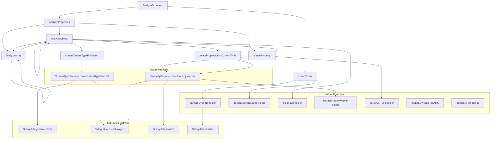

# Analyzer.go Refactoring Plan

## Overview

This document outlines the comprehensive refactoring plan for `analyzer.go` and `analyzer_test.go` based on detailed call graph analysis. The goal is to break down the monolithic 804-line file into smaller, more maintainable components while preserving functionality and improving testability.

## Current State Analysis

### File Statistics
- **`analyzer.go`**: 804 lines
- **`analyzer_test.go`**: 397 lines  
- **Total**: 1,201 lines

### Key Issues Identified
1. **Monolithic Structure**: Single file with multiple responsibilities
2. **Mixed Concerns**: String utilities, factories, and analysis logic intermingled
3. **Duplicate Functions**: Helper functions duplicated across the file
4. **Testing Gaps**: Missing test coverage for utilities and factories
5. **Circular Dependencies**: Complex internal function call relationships

## Call Graph Analysis

### Function Dependency Mapping



### Key Dependency Insights

1. **Heavy Cross-Dependencies**: Analysis engine methods are mutually recursive
2. **Factory Coupling**: Both factories heavily depend on `StringUtils`
3. **Helper Function Usage**: Many helpers used by both analysis engine and factories
4. **Circular Dependencies**: Some helper functions duplicate `StringUtils` functionality

## Refined File Breakdown Strategy

### Target File Structure

| **File** | **Purpose** | **Dependencies** | **Lines** | **Source Lines** |
|----------|-------------|------------------|-----------|------------------|
| `types.go` | Core data structures | None | ~35 | 13-46 |
| `string_utils.go` | String utilities (self-contained) | None | ~130 | 48-180 |
| `helpers.go` | Pure utility functions | `string_utils.go` | ~100 | 668-804 (consolidated) |
| `property_factory.go` | Property creation | `string_utils.go`, `helpers.go` | ~80 | 182-259 |
| `custom_type_factory.go` | Custom type creation | `string_utils.go`, `helpers.go` | ~150 | 261-449 |
| `schema_analyzer.go` | Main analysis engine | All above files | ~250 | 451-666 + orchestration |

### Dependency Flow

```
types.go (base types)
    ↑
string_utils.go (no dependencies)
    ↑
helpers.go (uses string_utils)
    ↑
property_factory.go
custom_type_factory.go  
    ↑
schema_analyzer.go (main orchestrator)
```

## Detailed Component Design

### 1. `types.go` (~35 lines)
**Purpose**: Core data structures
**Content**:
- `SchemaAnalyzer` struct
- `EventInfo` struct
- `PropertyInfo` struct  
- `CustomTypeInfo` struct
- Enums: `SanitizationMode`, `UniquenessStrategy`

**Dependencies**: None

### 2. `string_utils.go` (~130 lines)
**Purpose**: Self-contained string manipulation utilities
**Content**:
- `StringUtils` struct and methods
- `sanitize()`, `sanitizeBasic()`, `sanitizeEventID()`
- `generateHash()`, `ensureUnique()` variants
- All sanitization and uniqueness logic

**Dependencies**: None (completely self-contained)

### 3. `helpers.go` (~100 lines)
**Purpose**: Pure utility functions used across components
**Content**:
- `buildPath()`, `extractPropertyName()`
- `getJSONType()`, `mapJSONTypeToYAML()`
- `generateEventName()`, `generateRandomID()`
- Consolidated helper functions (eliminating duplicates)

**Dependencies**: `string_utils.go`

### 4. `property_factory.go` (~80 lines)
**Purpose**: Property creation and management
**Content**:
- `PropertyFactory` struct and constructor
- `createPropertyInternal()`
- `generateUniquePropertyID()`

**Dependencies**: `string_utils.go`, `helpers.go`

### 5. `custom_type_factory.go` (~150 lines)
**Purpose**: Custom type creation and management
**Content**:
- `CustomTypeFactory` struct and constructor
- `createCustomTypeInternal()`
- `generateStructureHash()`, `generateCustomTypeID()`
- `generateUniqueCustomTypeName()`, `generateCustomTypeName()`

**Dependencies**: `string_utils.go`, `helpers.go`

### 6. `schema_analyzer.go` (~250 lines)
**Purpose**: Main analysis orchestration
**Content**:
- `NewSchemaAnalyzer()` constructor
- `AnalyzeSchemas()` main entry point
- `extractEvent()`, recursive analysis methods
- `analyzeProperties()`, `analyzeObject()`, `analyzeArray()`
- Custom type and property creation orchestration
- Backward compatibility wrapper methods

**Dependencies**: All above files

## Test File Breakdown Strategy

### Target Test Structure

| **Test File** | **Purpose** | **Lines** | **Content** |
|---------------|-------------|-----------|-------------|
| `types_test.go` | Type definitions | ~30 | Constructor tests, struct validation |
| `string_utils_test.go` | String utilities | ~150 | Sanitization, uniqueness, hash generation |
| `helpers_test.go` | Helper functions | ~80 | Utility function tests |
| `property_factory_test.go` | Property factory | ~70 | Property creation, ID generation |
| `custom_type_factory_test.go` | Custom type factory | ~100 | Custom type creation, naming |
| `schema_analyzer_test.go` | Main analysis | ~180 | Integration tests, orchestration |

### New Test Coverage Areas

1. **String Utilities** (~150 lines)
   - Sanitization mode testing
   - Uniqueness strategy testing  
   - Hash generation testing
   - Edge cases for special characters

2. **Factory Tests** (~170 lines)
   - Property factory method testing
   - Custom type factory method testing
   - ID and name generation testing
   - Error handling scenarios

## Implementation Strategy

### Phase 1: Foundation Setup
1. Create `types.go` with core structures
2. Extract `string_utils.go` with comprehensive tests
3. Validate string utilities work independently

### Phase 2: Utility Layer
1. Create `helpers.go` consolidating utility functions
2. Add comprehensive helper tests
3. Eliminate duplicate functions

### Phase 3: Factory Layer  
1. Extract `property_factory.go` with dependencies
2. Extract `custom_type_factory.go` with dependencies
3. Add factory-specific tests
4. Validate factory operations

### Phase 4: Main Engine
1. Refactor `schema_analyzer.go` as orchestrator
2. Add integration tests
3. Ensure backward compatibility
4. Validate complete functionality

### Phase 5: Test Reorganization
1. Split existing tests by functionality
2. Add missing coverage areas
3. Ensure all tests pass
4. Validate coverage improvements

## Line Count Analysis

### Source Code Changes
| **Category** | **Before** | **After** | **Change** |
|--------------|------------|-----------|------------|
| **Original File** | 804 lines | 0 lines | -804 lines |
| **New Files** | 0 lines | 765 lines | +765 lines |
| **Net Source** | 804 lines | 765 lines | **-39 lines** |

### Test Code Changes  
| **Category** | **Before** | **After** | **Change** |
|--------------|------------|-----------|------------|
| **Original Test** | 397 lines | 0 lines | -397 lines |
| **New Test Files** | 0 lines | 610 lines | +610 lines |
| **Net Tests** | 397 lines | 610 lines | **+213 lines** |

### Total Impact
| **Category** | **Before** | **After** | **Change** |
|--------------|------------|-----------|------------|
| **Total Lines** | 1,201 lines | 1,375 lines | **+174 lines** |

### Line Reduction Sources (-39 lines)
- Elimination of duplicate helper functions: -20 lines
- Consolidation of package declarations: -5 lines  
- Removal of redundant comments: -8 lines
- Code organization efficiency: -6 lines

### Line Addition Sources (+213 lines)
- New string utilities test coverage: +150 lines
- New factory pattern test coverage: +70 lines
- Additional edge case tests: +40 lines
- Test organization overhead: -47 lines

## Benefits of This Approach

### Code Organization
1. **Single Responsibility**: Each file has clear, focused purpose
2. **Minimal Dependencies**: Clear unidirectional dependency flow
3. **Self-Contained Utilities**: No circular dependencies
4. **Logical Grouping**: Related functions stay together

### Maintainability  
1. **Easier Navigation**: Smaller, focused files
2. **Reduced Coupling**: Clear interface boundaries
3. **Better Testability**: Each component can be tested independently
4. **Simplified Debugging**: Issues easier to locate and fix

### Test Coverage
1. **Comprehensive Coverage**: Previously untested utilities now covered
2. **Parallel Testing**: Independent test files can run concurrently
3. **Focused Testing**: Each test file targets specific functionality
4. **Better Reliability**: More thorough edge case coverage

### Development Workflow
1. **Parallel Development**: Multiple developers can work on different components
2. **Incremental Changes**: Easier to make targeted modifications
3. **Code Reviews**: Smaller, focused changes in reviews
4. **Regression Prevention**: Better test coverage prevents bugs

## Risk Mitigation

### Potential Issues
1. **Import Complexity**: Multiple imports vs. single file
2. **Interface Changes**: Public method signatures must remain stable
3. **Test Migration**: Existing tests need careful reorganization
4. **Backward Compatibility**: External consumers must continue working

### Mitigation Strategies
1. **Gradual Migration**: Implement incrementally with validation
2. **Interface Stability**: Maintain public API compatibility
3. **Test Preservation**: Migrate existing tests before adding new ones
4. **Comprehensive Testing**: Run full test suite after each phase

## Success Criteria

### Functional Requirements
- [ ] All existing functionality preserved
- [ ] No API breaking changes
- [ ] All existing tests continue to pass
- [ ] Performance characteristics maintained

### Quality Improvements  
- [ ] Test coverage increased by >30%
- [ ] File sizes reduced to <300 lines each
- [ ] Circular dependencies eliminated
- [ ] Code duplication removed

### Maintainability Gains
- [ ] Clear separation of concerns achieved
- [ ] Dependencies unidirectional and minimal
- [ ] Each file testable independently
- [ ] Documentation updated and comprehensive

## Conclusion

This refactoring plan addresses the monolithic nature of `analyzer.go` while respecting actual function dependencies revealed through call graph analysis. The result is a more maintainable, testable, and extensible codebase with improved separation of concerns and comprehensive test coverage.

The net addition of 174 lines is primarily due to enhanced test coverage (+213 lines) while actually reducing source code complexity (-39 lines). This investment in testing infrastructure will pay dividends in long-term maintainability and reliability. 