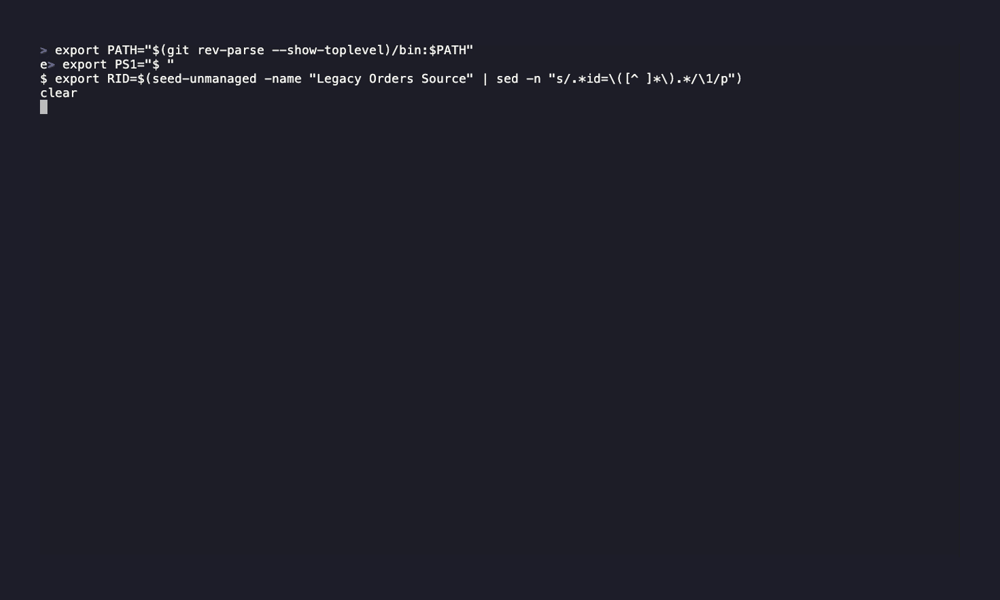

# rudder-cli — kubectl-style verbs, in motion

Short terminal recordings of the new verb layer over RudderStack resources:
`get` / `describe` / `delete` / `set-external-id` (top-level), plus a scoped,
delete-free `apply -f`, and accounts surfaced as a read resource.

Each recording runs **live** against a real workspace. Sources are typed as
on-screen `#` comments so every step explains itself. Configs are in each demo
dir; regenerate with `bash docs/demos/record-demos.sh` (see [README](README.md)).

> **Experimental.** This whole suite is gated behind the `resourceCommands`
> experimental flag. Enable it first:
>
> ```bash
> rudder-cli experimental enable resourceCommands
> # or, ephemerally: RUDDERSTACK_CLI_EXPERIMENTAL=true RUDDERSTACK_X_RESOURCE_COMMANDS=true rudder-cli get ...
> ```
>
> Without it the verbs are hidden and error with the enable instructions. (The
> demo recordings set the env vars in hidden setup.)

---

## 1. Observe — discover resources (read-only)

One grammar over every resource type. `get` lists what's there, the `MANAGED`
column shows what IaC owns vs what only lives upstream, `-l key=value` filters,
`--managed` / `--unmanaged` split the two, and accounts answer to `get` too.

```
rudder-cli get --help
rudder-cli get tracking-plan
rudder-cli get tracking-plan -l name="Sample ecomm"
rudder-cli get tracking-plan --managed
rudder-cli get event-stream-source
rudder-cli get account
```


---

## 2. Build — the managed lifecycle, all scoped

Create, inspect, update and delete one source — without touching anything else.
`apply -f` is **scoped**: it only applies the files you pass and never deletes
out-of-scope resources. `get -o yaml` emits a re-appliable spec (so
`get -o yaml | apply -f -` is a no-op), `describe` lays it out, and `delete`
removes it. The workspace ends exactly as it started.

```
rudder-cli apply -f orders.yaml --dry-run --confirm=false   # preview
rudder-cli apply -f orders.yaml --confirm=false             # create (scoped)
rudder-cli get event-stream-source                          # MANAGED=yes; others untouched
rudder-cli get event-stream-source demo-orders-source -o yaml
rudder-cli describe event-stream-source demo-orders-source
rudder-cli apply -f orders-v2.yaml --confirm=false          # update one field
rudder-cli delete event-stream-source demo-orders-source --confirm
```


---

## 3. Adopt — bring an unmanaged resource under IaC

`set-external-id` associates an existing **unmanaged** remote resource (one with
no external id, e.g. created in the dashboard) with a local external id, making
it IaC-managed. Here a genuinely id-less source is seeded via the API, then
adopted — `MANAGED=no` becomes `MANAGED=yes`.

```
rudder-cli get event-stream-source -l name="Legacy Orders Source"   # MANAGED=no
rudder-cli set-external-id event-stream-source <remote-id> orders-pipeline
rudder-cli get event-stream-source -l name="Legacy Orders Source"   # MANAGED=yes
rudder-cli describe event-stream-source orders-pipeline
rudder-cli delete event-stream-source orders-pipeline --confirm
```



---

## 4. Guardrails — safe by design

Verbs are capability-gated, errors are loud, and blast radius is explicit.
Read-only accounts refuse mutating verbs; unknown types list every valid one;
`apply -f` (scoped) is contrasted with `apply --location` (whole-project
reconcile, can prune); and the old per-noun `workspace … list` commands now
point you at `get`.

```
rudder-cli set-external-id account acct_123 my-account   # refused: read-only type
rudder-cli get widget                                    # unknown type -> lists valid types
rudder-cli apply --help                                  # -f vs --location blast radius
rudder-cli set-external-id --help
rudder-cli workspace accounts list                       # deprecated -> use 'get account'
```


---

> MP4 versions render alongside each GIF when you run `record-demos.sh`
> (transcoded from the GIF; git-ignored). The Build and Adopt demos mutate a live
> workspace and clean up after themselves.
