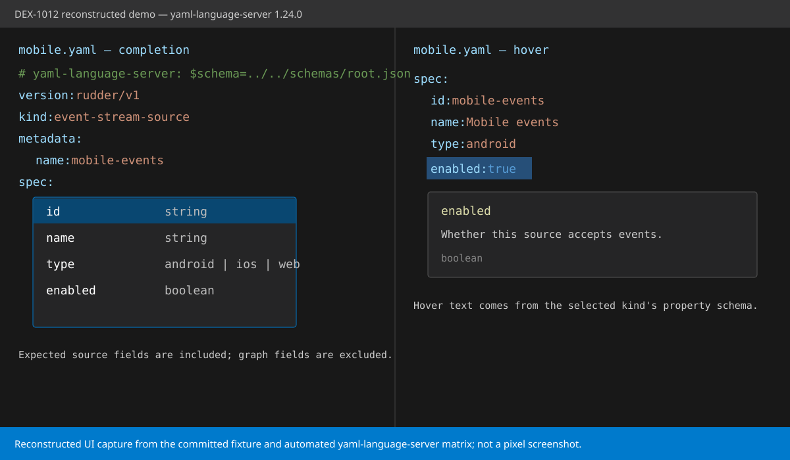

# DEX-1012 editor association demo

This self-contained fixture demonstrates schema association for Rudder YAML files
whose names and directories are arbitrary. The schemas are deliberately small,
hand-written spike fixtures; DEX-1000's generated schemas replace them in the
follow-up implementation.



The image is a reconstructed VS Code-style UI based on the checked-in files and
the automated language-server result in
[`evidence/yaml-language-server-matrix.json`](evidence/yaml-language-server-matrix.json).
The automated run used yaml-language-server 1.24.0, the current server at spike
time, and directly exercised the sample modelines, relative schema paths, and a
`yaml.schemas`-equivalent association.

**VS Code UI proof status:** incomplete. A browser-installable VS Code binary was
unavailable in the build environment, so the committed image is not claimed to
be a pixel screenshot or GIF from VS Code with the Red Hat YAML extension. The
headless matrix proves yaml-language-server behavior only; before Part 2 ships,
record a real VS Code screenshot/GIF or screencast with the Red Hat YAML
extension and the version numbers used.

## What is included

- `samples/sources/mobile.yaml`: arbitrary path/name associated by a root-schema
  modeline.
- `samples/customer-360.yaml`: a second kind (`data-graph`) associated by the
  same root schema.
- `samples/per-kind-source.yaml`: the same source shape associated directly with
  the per-kind schema.
- `samples/settings-associated.yaml`: no modeline; `.vscode/settings.json`
  associates this exact arbitrary filename through `yaml.schemas`.
- `schemas/root.json`: a Draft 7 root schema using explicit, required `kind`
  discriminators and `if`/`then` branches.
- `schemas/event-stream-source.json` and `schemas/data-graph.json`: stand-alone
  per-kind alternatives.
- `verify.mjs`: the executable completion, hover, and validation matrix.

## Manual VS Code proof still required

These steps are the remaining acceptance check to run in a desktop VS Code
session; they are not completed by the checked-in headless matrix.

1. Open this `docs/dex-1012-demo` directory as the workspace.
2. Install the recommended `redhat.vscode-yaml` extension.
3. Open `samples/sources/mobile.yaml`.
4. Remove a key below `spec:`, place the cursor at that indentation, and invoke
   **Trigger Suggest**. The expected source fields (`id`, `name`, `type`, and
   `enabled`) are offered and data-graph fields are not.
5. Hover `enabled`: the hover reads “Whether this source accepts events.”
6. Change `kind` to `data-graph`. Source keys become invalid and completion
   switches to `id`, `account_id`, and `models`.
7. Repeat in `samples/per-kind-source.yaml`; source completion/hover is the same,
   without waiting for a discriminator.
8. Open `samples/settings-associated.yaml` to verify project-level association
   without a modeline.

## Re-run the headless matrix

The checker uses the same `yaml-language-server` package embedded by Red Hat
YAML. Dependencies are intentionally not vendored into this docs-only spike.

```sh
mkdir -p /tmp/dex-1012-yls
npm install --prefix /tmp/dex-1012-yls \
  yaml-language-server@1.24.0 \
  vscode-languageserver-textdocument@1.0.12
node verify.mjs
```

Set `DEX_1012_YLS_ROOT` to use a dependency directory other than
`/tmp/dex-1012-yls`.

The assertions cover:

| Schema | State | Expected result |
| --- | --- | --- |
| Root and source per-kind modelines | blank document | envelope completion (`version`, `kind`, `metadata`, `spec`) |
| Root modeline | `kind: event-stream-source` | source fields included; graph fields excluded below `spec` |
| Root modeline | `kind: data-graph` | graph fields included; source fields excluded below `spec` |
| Per-kind modeline | event stream source | source completion and hover below `spec` |
| `yaml.schemas` equivalent | event stream source | source completion without a modeline |
| Root modeline | missing `kind` | no kind-specific completion and a missing-kind diagnostic |
| Root modeline | kind changed but source fields remain | wrong-kind and missing graph-field diagnostics |
| Root modeline | hover on `spec.enabled` | source field documentation |

The checked-in matrix output is evidence, not a replacement for the manual VS
Code steps. It makes the behavior reproducible even when a desktop session is
not available.
