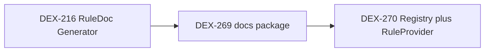

# DEX-270: [Phase 2] Registry Extension + RuleProvider Interface — Implementation Spec

**Linear:** [DEX-270](https://linear.app/rudderstack/issue/DEX-270/phase-2-registry-extension-ruleprovider-interface)

## Implementation checklist

- [ ] Add `AllSyntacticRules` / `AllSemanticRules` to `rules.Registry` + `defaultRegistry` + tests in `registry_test.go`
- [ ] Add `RuleDocEntries()` to `RuleProvider`; `EmptyProvider` + `BaseProvider` defaults; `CompositeProvider` aggregation; import `validation/docs` in the provider package
- [ ] Run `make test` / `make lint`; fix any standalone `Provider` mocks missing `RuleDocEntries`

---

## Source of truth


| Item                   | Detail                                                                                                                                                                                                                      |
| ---------------------- | --------------------------------------------------------------------------------------------------------------------------------------------------------------------------------------------------------------------------- |
| **Ticket**             | [DEX-270 — Phase 2: Registry Extension + RuleProvider Interface](https://linear.app/rudderstack/issue/DEX-270/phase-2-registry-extension-ruleprovider-interface)                                                            |
| **Parent**             | [DEX-216 — RuleDoc Generator](https://linear.app/rudderstack/issue/DEX-216/ruledoc-generator) (epic; links to Linear doc *Validation Rule Documentation Generator Specification*)                                           |
| **Phase 1 dependency** | [dex-269-docs-package-foundation.md](./dex-269-docs-package-foundation.md) — introduces `cli/internal/validation/docs` ([`RuleDocEntry`](../cli/internal/validation/docs/types.go), resolved aggregate **`RulesDoc`**) |


### Naming (DEX-269 / docs package)

The **resolved** YAML root type is **`RulesDoc`** ([`types.go`](../cli/internal/validation/docs/types.go), [`RulesDoc.Validate`](../cli/internal/validation/docs/rules_doc.go)). Older specs and the DEX-216 Linear document may still say `Catalog`; in this repo **`RulesDoc`** is canonical. DEX-270 does not require changing `RulesDoc` itself—only wiring `RuleDocEntries()` and registry enumeration.

### Parent context (DEX-216)

DEX-216 has minimal inline description in Linear but anchors the **RuleDoc Generator** initiative: machine-readable rule documentation (YAML catalog, stable `rule_id`), with later phases wiring providers and tooling. DEX-270 is the **interface and registry plumbing** phase so subsequent phases can collect authored YAML fragments from providers and correlate them with registered `rules.Rule` instances.




---

## Goals (from DEX-270)

1. **`rules.Registry`**: Add full enumeration — `AllSyntacticRules() []Rule` and `AllSemanticRules() []Rule` on the interface, implemented by [`defaultRegistry`](../cli/internal/validation/rules/registry.go) by returning copies (or the underlying slices; document immutability expectations).
2. **`RuleProvider`**: Add `RuleDocEntries() []docs.RuleDocEntry` to [`RuleProvider`](../cli/internal/provider/provider.go) (requires import: `github.com/rudderlabs/rudder-iac/cli/internal/validation/docs`).
3. **Defaults**: [`EmptyProvider`](../cli/internal/provider/emptyprovider.go) and [`BaseProvider`](../cli/internal/provider/baseprovider.go) return `nil` (or empty slice — prefer `nil` to match ticket) so existing behavior is unchanged.
4. **Composite**: [`CompositeProvider`](../cli/internal/provider/composite.go) implements `RuleDocEntries()` by concatenating each child provider’s entries (ticket’s append loop).
5. **Concrete providers**: Initially contribute **no** docs — satisfied by embedding `EmptyProvider` / `*BaseProvider` without per-file stubs **unless** you want explicit methods for readability (see “Scope note” below).

### Verification

- `make test` (and `make lint` per repo standards).

---

## Detailed design

### 1. Registry ([`cli/internal/validation/rules/registry.go`](../cli/internal/validation/rules/registry.go))

**Interface additions:**

```go
AllSyntacticRules() []Rule
AllSemanticRules() []Rule
```

**`defaultRegistry` implementation:**

- Return `r.syntactic` and `r.semantic` respectively (or append to new slices if mutability of returned slices must not alias internal storage — prefer **defensive copy** if callers might mutate: `append([]Rule(nil), r.syntactic...)`).

**Tests** ([`cli/internal/validation/rules/registry_test.go`](../cli/internal/validation/rules/registry_test.go)):

- After registering N syntactic and M semantic rules, `AllSyntacticRules` / `AllSemanticRules` return the expected lengths and IDs.
- Optional: assert returned slice is not the same backing array as internal if you choose defensive copy (use different capacity or compare append behavior).

### 2. `RuleProvider` + defaults

**Interface** ([`cli/internal/provider/provider.go`](../cli/internal/provider/provider.go)):

```go
RuleDocEntries() []docs.RuleDocEntry
```

**`EmptyProvider`** ([`cli/internal/provider/emptyprovider.go`](../cli/internal/provider/emptyprovider.go)):

```go
func (p *EmptyProvider) RuleDocEntries() []docs.RuleDocEntry { return nil }
```

**`BaseProvider`** ([`cli/internal/provider/baseprovider.go`](../cli/internal/provider/baseprovider.go)):

- Add `RuleDocEntries() []docs.RuleDocEntry { return nil }` on `*BaseProvider` so a future phase can aggregate from `RuleHandler`-like doc sources without changing `EmptyProvider` semantics for non-base stubs.

**`CompositeProvider`** ([`cli/internal/provider/composite.go`](../cli/internal/provider/composite.go)):

- Implement `RuleDocEntries()` by iterating `p.Providers` and appending `provider.RuleDocEntries()...`.
- Update the compile-time assertion comment if it only mentions `RuleProvider` / `SpecFactoryProvider` — add note that `RuleDocEntries` is implemented.

### 3. Call sites that must still compile

- **`Provider` embeds `RuleProvider`** — any type implementing `Provider` needs the new method. Embedding [`EmptyProvider`](../cli/internal/provider/emptyprovider.go) or [`BaseProvider`](../cli/internal/provider/baseprovider.go) picks up the default.
- **[`MockProvider`](../cli/internal/testutils/mockprovider.go)** embeds `EmptyProvider` — no change if `EmptyProvider` gains `RuleDocEntries()`.

### 4. Linear “six provider.go files” — scope note

The ticket lists:

- `datacatalog`, `event-stream`, `retl`, `transformations`, `workspace`, `datagraph`

**Reality check:** [`cli/internal/providers/workspace/provider.go`](../cli/internal/providers/workspace/provider.go) is **not** a `provider.Provider` (it only exposes lister-style APIs and `SupportedKinds`/`SupportedTypes`). It does **not** implement `RuleProvider` today, so **no `RuleDocEntries` change applies there** unless product intentionally extends that type later.

**Composite members** ([`cli/internal/app/dependencies.go`](../cli/internal/app/dependencies.go)): `datacatalog`, `retl`, `eventstream`, `transformations`, optional `datagraph` — all embed `EmptyProvider` or `*BaseProvider`, so **no edits to individual `provider.go` files are required** for compilation if defaults live on `EmptyProvider`/`BaseProvider`.

If you need **ticket-for-ticket** parity with Linear, add explicit `RuleDocEntries() []docs.RuleDocEntry { return nil }` on each `Provider` struct that does not inherit the method (none today for composite providers) — this would be redundant noise; prefer relying on embedding.

---

## Out of scope (later DEX phases)

- Loading YAML fragments from disk (`docs.LoadFragment`), merging into a resolved **`RulesDoc`**, or `gen-rule-docs` CLI.
- Populating real `RuleDocEntry` data per provider (still `nil` in Phase 2).

---

## Risk / impact

- **Low**: Interface extension with nil defaults; registry methods are additive.
- **Watch**: Any **custom** `Provider` implementations outside the main tree (tests, examples) must add `RuleDocEntries()` — grep for `type .* struct` implementing full `Provider` if `make test` fails.
