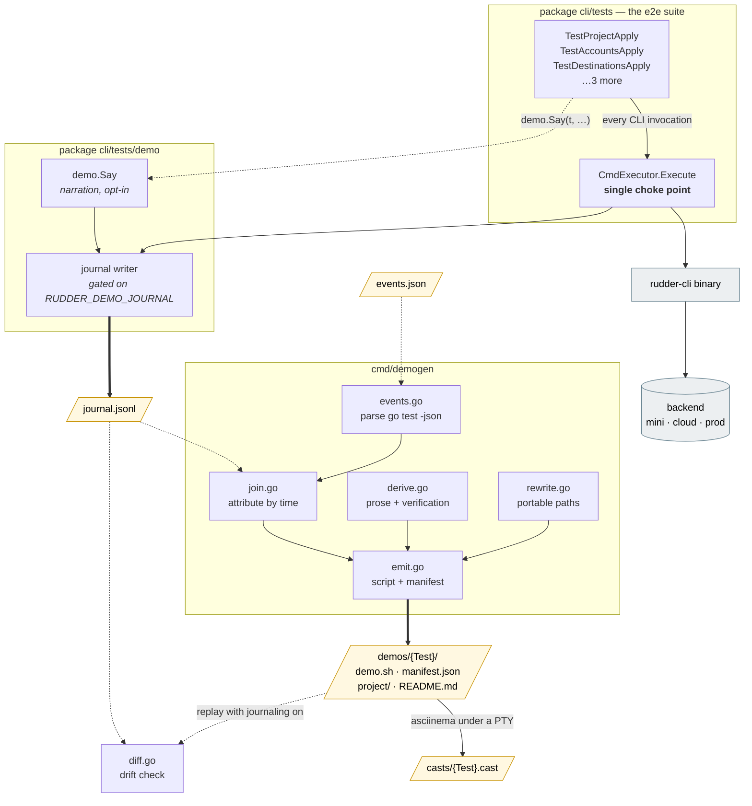
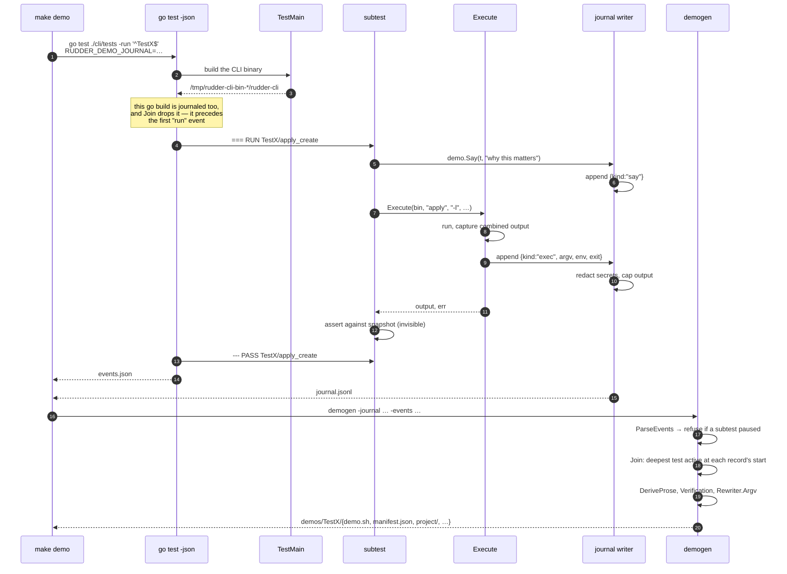
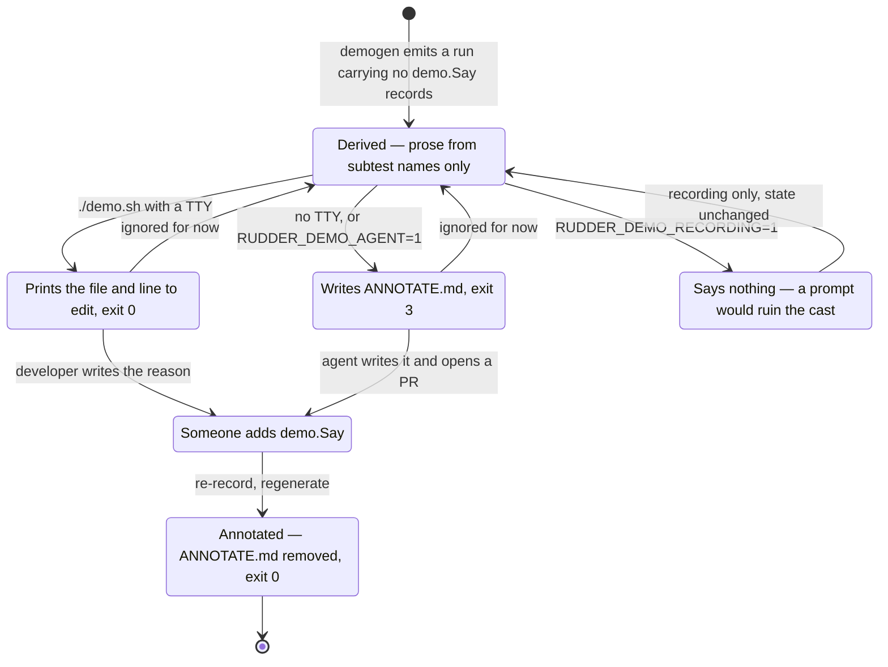
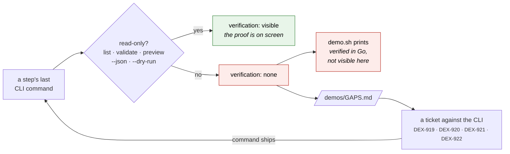

# Demoing the e2e suite

**Status:** design, awaiting review
**Date:** 2026-09-20
**Scope:** `cli/tests/` in `rudder-iac`

## Problem

Two bodies of work cover the same ground and share nothing.

The e2e suite (`cli/tests/`) drives the real CLI against a real backend and
asserts against committed snapshots. It is thorough and completely opaque: its
output is pass, fail, or a JSON diff. Reading a test tells you what it runs;
nothing tells you what it *looks like* to run.

The demos (`~/workspace/retl-alignment/demos/`) are hand-written demo-magic
scripts, recorded with asciinema and embedded in a page with castplay. They are
legible, narrated and reproducible — and entirely disconnected from the tests,
so they are written by hand each time and go stale silently. A standing rule
exists to re-run every demo after each round of review feedback, which is
manual regression testing wearing a costume.

Demos are for humans. They make an e2e test comprehensible, and they make a
scenario reproducible by hand — by a person or by an agent. That is the purpose
this design serves. The demos are not a CI gate.

## What this builds

A pipeline that turns a real e2e test run into a narrated, reproducible,
provenance-stamped demo, with no rewrite of the tests.

```
make demo-record      go test (real run) ──► journal.jsonl + go-test-events.json
make demo-generate    journal + events   ──► demos/<Test>/{demo.sh,manifest.json,project/,README.md}
make demo-run         demo.sh            ──► a human watches it, or reproduces it by hand
make demo-cast        demo.sh under PTY  ──► casts/<Test>.cast  (+ provenance in the header)
make demo-check       replay demo.sh     ──► diff its journal against the test's; fail on drift
```

Four passes, each a file in and a file out. Any one can be run alone.

## Diagrams

### Components

What exists, and which direction the dependencies point. The dashed edges are
the ones that carry no code dependency at all — a file on disk is the only
coupling between a test run and the thing that reads it.



The generator never imports the test suite and the suite never imports the
generator. They share one type — `demo.Record` — and meet only as JSONL on
disk. That is what lets a demo be generated long after the run that produced
it, on a different machine, by a different tool.

### Recording a run, end to end



Redaction happens at step 9, inside the writer — before the record reaches
disk, never as a later scan. A value that was never written cannot leak from a
committed artifact.

### How a record finds its subtest

The join is the one piece whose correctness is not obvious. Records carry
timestamps; `go test -json` carries `run`/`pass` events. Because package
`cli/tests` is serial, "which test was running" has exactly one answer at any
instant — the most deeply nested span covering it.

```mermaid
gantt
  dateFormat  X
  axisFormat  %Ss
  title       Spans from go test -json, records placed by start time

  section TestProjectApply
  span (parent)                 :active, p, 0, 10
  section rudder_specs
  span (child)                  :active, c, 1, 9
  section should_create_entities
  span (grandchild)             :active, g1, 2, 6
  section should_update_entities
  span (grandchild)             :active, g2, 7, 9
  section journal records
  apply -l create      (t=3)    :milestone, r1, 3, 0
  apply -l create      (t=5)    :milestone, r2, 5, 0
  apply -l update      (t=8)    :milestone, r3, 8, 0
  go build             (t=0)    :milestone, r0, 0, 0
```



`t=3` and `t=5` fall inside three spans and go to the deepest,
`should_create_entities`. `t=8` goes to `should_update_entities`. The `go build`
at `t=0` is inside the parent only — but it precedes the first `run` event the
generator saw, so it belongs to no step and is dropped rather than opening the
demo with a compiler invocation.

A `pause` event anywhere in this package means a subtest went parallel and the
question stops having one answer. The generator refuses the run instead of
producing a demo whose steps are silently shuffled.

### The annotation loop

A demo that lacks narration asks for it, and the way it asks depends on who is
running it. This is the mechanism that turns thin derived demos into written
ones over time, instead of leaving them thin forever.



### Where verification goes when it cannot be seen



The loop closes on itself deliberately. A step that cannot show its result is
not a demo problem to be worked around — it is a missing read-only command, and
`GAPS.md` is the standing list of them. DEX-921 states the rule this design
adopts: *"A demo that has to leave the tool it is demonstrating is a gap in the
tool."*

## Scope

**In:** the six existing top-level e2e tests.

| Test | File |
|---|---|
| `TestProjectApply` | `command_apply_test.go` |
| `TestDestinationsApply` | `command_destinations_apply_test.go` |
| `TestAccountsApply` | `command_accounts_apply_test.go` |
| `TestAccountsImportWorkspace` | `command_accounts_import_test.go` |
| `TestConnectionsApply` | `command_connections_apply_test.go` |
| `TestTransformationsTest` | `command_transformations_test.go` |

**Out:** anything a test does not already do. A demo shows the test's own
world — apply, read back, assert — and nothing more. The data-plane demos (a
seeded Postgres, a sink observing deliveries, a triggered sync) need fixtures
no test builds, so `11-e2e-sqlmodel` stays hand-written and outside this
framework. It joins for free when the rETL e2e tests land through DEX-904,
DEX-866 and DEX-901.

This boundary is deliberate and is the thing that keeps a fixture-hook system
from ever being written. A demo is a faithful projection of a test run; the way
to get a richer demo is to write a richer test.

## Design

### Pass 1 — the journal

`Executor` is the single choke point. Every CLI invocation in the suite goes
through `CmdExecutor.Execute`, so one hook there records the entire run with no
edits to any test.

```go
// helpers.go, inside Execute, guarded by the env var
type record struct {
    Kind     string            `json:"kind"`      // "exec" | "say"
    Start    time.Time         `json:"start"`
    End      time.Time         `json:"end"`
    Dir      string            `json:"dir"`
    Argv     []string          `json:"argv"`
    Env      map[string]string `json:"env"`       // RUDDERSTACK_* only
    ExitCode int               `json:"exitCode"`
    Output   string            `json:"output"`    // capped
}
```

Enabled only when `RUDDER_DEMO_JOURNAL=<path>` is set, so an ordinary
`make test-e2e` pays nothing and behaves identically.

`Env` is filtered to the `RUDDERSTACK_*` prefix and captured at call time,
which is how the generated script learns that a step needs
`RUDDERSTACK_X_RETL_TABLE_SUPPORT=true`. Tests set these with `t.Setenv`; the
filter picks them up without the test knowing. Tokens are never recorded — see
Security below.

**Attributing commands to subtests.** `Execute` has no `*testing.T`, and
threading one through would touch every call site. Instead the journal carries
timestamps and `make demo-record` captures `go test -json` alongside it; the
generator joins the two streams on time.

The join is exact because package `tests` — the only package that drives the
CLI binary — is serial: it contains no `t.Parallel()` and sets
`concurrencyForTest = 1`. Its sibling `cli/tests/helpers` *is* parallel
throughout, but those are ordinary unit tests that never touch `Executor`, so
they contribute no journal records. Two consequences:

- `demo-record` runs `go test -json ./cli/tests -run <Test>`, not
  `./cli/tests/...`. Narrowing to the one package removes the cross-package
  interleaving that `go test`'s default `-p` would otherwise produce, and
  avoids recording a run of unit tests nobody wants to watch.
- The generator ignores events outside package `tests`, and fails loudly if a
  parallel subtest ever appears *within* it, rather than producing a quietly
  scrambled demo.

### Pass 2 — generation

`cli/tests/demo/cmd/demogen` reads the journal and the events and writes, per
top-level test:

```
demos/TestProjectApply/
  demo.sh          demo-magic script
  manifest.json    provenance, steps, annotation state, gaps
  project/         spec fixtures, copied with paths rewritten
  README.md        how to run this by hand
  ANNOTATE.md      present only when narration is missing (see below)
```

Each `=== RUN TestX/sub` becomes a section header; each `exec` record becomes a
`pe` line.

**Narration comes from two places (the hybrid).**

*Derived, always.* Subtest names carry most of the prose already.
`should_create_entities_in_catalog_from_project` becomes
`# Create entities in catalog from project`. Underscores to spaces, drop a
leading "should", sentence case. Every test is demoable the day this lands.

*Annotated, where it earns it.* One helper:

```go
demo.Say(t, "This is the DEX-917 fix: before it the connection was created but never read back.")
```

It writes a `say` record into the same journal, so annotated prose lands in the
right position in the stream automatically. When the journal env is unset it is
a single `if` and returns. No sidecar file, no YAML, no drift between narration
and the code it describes.

There is no `demo.Verify`. Read-back commands are journaled automatically like
any other; a `demo.Say` immediately before one is the label.

**Annotated demos get a special mention.** `manifest.json` records
`annotated: true|false` per section and for the demo overall. The player renders
an `annotated` chip; `README.md` says so; a fully derived demo is marked as
such rather than passing itself off as authored.

**Missing narration asks for itself.** When `demo.sh` runs in *interactive*
mode and its manifest is unannotated, it prints a footer naming the test and
line to add `demo.Say` to. It never prompts during recording, which would ruin
the cast.

When run non-interactively — no TTY, or `RUDDER_DEMO_AGENT=1` — it instead
writes `ANNOTATE.md`: the derived steps, the `file:line` of each, and an
instruction to add `demo.Say` calls and open a PR. It exits `3`, distinct from
a failure, so an agent harness notices without treating it as a broken demo.
Detection is `[ -t 1 ]` plus that explicit override; nothing cleverer.

**Path rewriting** is the fragile part. The generator rewrites a known set: the
test's `testdata` directory to `./project`, the built binary to `rudder-cli`,
`t.TempDir()` roots to `./work`. Anything left absolute is recorded in the
manifest as a portability gap and printed by `demo-check`. The drift check
(pass 4) is what keeps this honest rather than trust.

### Pass 3 — recording and provenance

`demo.sh` runs under a PTY with asciinema. Every output carries its origin,
stamped into both `manifest.json` and the asciicast v2 header:

```json
{
  "test": "TestProjectApply",
  "recordedAt": "2026-09-20T09:14:02Z",
  "git": { "ref": "refs/pull/892/head", "sha": "1a2b3c4d",
           "describe": "v1.12.0-14-gce79745b", "dirty": false },
  "backend": { "profile": "mini", "kind": "local",
               "apiURL": "http://localhost:15580" },
  "cliVersion": "v1.12.0-14-gce79745b",
  "flags": ["RUDDERSTACK_X_RETL_TABLE_SUPPORT=true"],
  "annotated": false,
  "durationSeconds": 74
}
```

`kind` is `local`, `staging` or `production`. `apiURL` is recorded for
everything except production, where it is the well-known endpoint and adds
nothing. The player renders this as a chip strip above each cast —
`PR #892 @ 1a2b3c4 · mini · derived · 20 Sep 2026` — so no recording can be
mistaken for a different branch or a different backend.

**Backends need no abstraction.** The CLI already selects one from two env
vars it reads today:

```bash
RUDDERSTACK_API_URL=http://localhost:15580
RUDDERSTACK_ACCESS_TOKEN=…
```

A profile is therefore an env file — `demos/profiles/{mini,cloud}.env` — not a
subsystem. `mini` for local verification, PR-supplied values for a cloud run,
nothing for prod. The profile name and resolved URL go into the stamp. No
profile registry, no config schema, no new flag.

### Pass 4 — the drift check

`make demo-check` re-runs the generated `demo.sh` with `RUDDER_DEMO_JOURNAL`
set and diffs its argv sequence against the test's journal, modulo the
rewritten paths. A mismatch means the generator or the script has drifted from
the test it claims to project.

This is the one mechanism that keeps a generated demo trustworthy, and it is
roughly forty lines. It needs a live backend, so it runs on demand and nightly,
not on every PR.

### Verification must be visible

A demo whose purpose is comprehension must not hide the moment of proof. The
e2e suite's verification is a Go-side struct compare that puts nothing on
screen, so each section is classified:

- The section ends in a read-only CLI command — `list`, `validate`,
  `--dry-run`, `--json`, `preview` — and counts as visibly verified.
- It does not, and the demo prints
  `# (verified in Go, not visible here — see command_apply_test.go:88)` and the
  manifest records `verification: "none"`.

Where no CLI command exists to read a thing back, the manifest records a gap
and the generator collects these into `demos/GAPS.md`. That file is the input
to tickets of the DEX-919/921/922 class, which were themselves written from
exactly this pain — DEX-921 states the rule this design adopts: *"A demo that
has to leave the tool it is demonstrating is a gap in the tool."* Its
acceptance criterion is replacing the `curl` in the recorded demo. So the
framework does not merely permit CLI-based verification; it names the absence
of one as a defect and produces the list.

Falling back to a raw `curl` or an `api.sh` in a demo is allowed and is
recorded as a gap, never silently accepted.

## Layout

```
cli/tests/
  helpers.go                    + ~25 lines: the journal hook in Execute
  demo/
    journal.go                  record type, writer, env-var gate
    say.go                      demo.Say — the only test-facing API
    cmd/demogen/main.go         journal + events -> demo.sh, manifest, fixtures
demos/
  profiles/{mini,cloud}.env
  <Test>/{demo.sh,manifest.json,project/,README.md}
  GAPS.md
casts/<Test>.cast
```

Generated demos and casts are committed. That is how a PR ships evidence of
what it changed, and how the provenance stamp has something to point at.

Publishing to a castplay page reuses the existing `retl-alignment/player.js`
and `build.py` pattern and is out of scope for this design.

## Testing

- Unit tests for `demogen`: the journal-to-events join (including a synthetic
  parallel-subtest journal, which must fail), subtest-name-to-prose
  derivation, path rewriting, and manifest assembly. Table-driven, whole-struct
  comparisons per CLAUDE.md.
- Unit tests for the journal hook: records written when the env var is set,
  nothing written and behaviour unchanged when it is not, `RUDDERSTACK_*`
  filtering, token redaction.
- One end-to-end check of the framework itself: record `TestAccountsApply`,
  generate, replay, and assert `demo-check` reports no drift. This is the
  smallest thing that fails if any pass breaks.
- `demo.Say` with no journal configured must be a no-op — asserted, because a
  regression there would break every ordinary `make test-e2e`.

## Security

The journal captures `RUDDERSTACK_*` env and command output, both of which can
carry secrets. `RUDDERSTACK_ACCESS_TOKEN` and any key matching
`*TOKEN*|*SECRET*|*PASSWORD*|*KEY*` is replaced with `<redacted>` before the
record is written — not at generation time, so a leaked value never reaches
disk. The destination suite already maintains
`destinationRawSecrets`, a literal list of fixture secrets that must never
surface in CLI output; the generator reuses that list as a final scan over
`demo.sh`, `manifest.json` and the cast, and refuses to write a demo that
contains any of them.

Committed casts are reviewed like any other artifact. Profile env files hold a
URL and a token *reference*, never a token.

## Risks

| Risk | Mitigation |
|---|---|
| Path rewriting misses a case, demo is not portable | Manifest records unrewritten absolute paths; `demo-check` prints them; drift check catches a demo that stops matching |
| The time join mis-attributes commands | Package `tests` is serial; the generator filters to it, asserts serialism within it, and fails on any parallel subtest rather than guessing |
| `demo-record` needs a live backend, so it is not a hermetic CI step | On demand and nightly; per-PR runs `demo-check` only when a backend is configured |
| `destroy --confirm=false` opens every demo and reads alarmingly | Generator flags it; `demo.Say` overrides the derived prose where it matters |
| Derived-only demos are thin and nobody annotates them | `ANNOTATE.md` plus exit 3 makes the gap actionable rather than invisible; the annotated chip makes the difference legible |

## Deferred

The unified scenario spec — one declarative scenario, two runners, one
asserting and one recording — remains the grand goal. Nothing here forecloses
it: the journal record is already that scenario, captured rather than authored.
If it is ever worth writing by hand, the format exists and has been exercised.

Fixture provisioning inside profiles (`setup`/`teardown` hooks) is explicitly
not built. A richer demo comes from a richer test.
